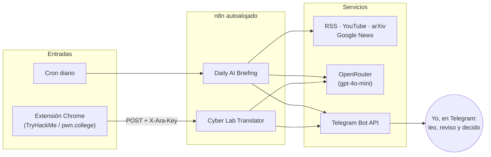

# n8n Automation Lab

Workflows de n8n que uso a diario en mi instancia autoalojada, exportados **sin credenciales ni datos privados** para que se puedan revisar e importar.

No son ejemplos de juguete: son las exportaciones reales, pasadas por un proceso de anonimización y documentadas nodo a nodo.

## Workflows

| Workflow | Qué hace | Disparador | Estado |
|---|---|---|---|
| [Daily AI Briefing (AUT-003)](workflows/daily-ai-briefing/) | Revisa unas 100 fuentes en español (blogs, canales de YouTube, arXiv), pide a un LLM un informe diario en JSON, lo convierte en HTML y lo envía por Telegram. Después redacta 3 borradores para X que reviso y publico a mano | Cron diario 08:00 | ✅ Activo |
| [Cyber Lab Translator](workflows/cyber-lab-translator/) | Extensión de Chrome + webhook autenticado: traduce salas de TryHackMe y pwn.college al castellano manteniendo los tecnicismos en inglés, sin resolver el lab | Webhook `POST` con cabecera de autenticación | ✅ Activo |

Tengo otros dos workflows que dependen de microservicios internos de mi servidor. No los publico, pero su arquitectura está descrita en [`docs/arquitectura-otros-workflows.md`](docs/arquitectura-otros-workflows.md).

## Arquitectura general



Todos los resultados llegan a un único chat privado de Telegram. Nada se publica de forma automática: los borradores para X incluyen un enlace para abrirlos en X y soy yo quien decide si se publican.

## Stack

- **n8n** autoalojado en un VPS: nodos Code (JavaScript), HTTP Request, Telegram, Webhook, Schedule, Respond to Webhook.
- **OpenRouter** como pasarela de LLMs (`openai/gpt-4o-mini`), con respuestas forzadas a JSON y validadas en código.
- **Telegram Bot API** para entregar informes HTML y borradores.
- **Extensión Chrome Manifest V3** (JavaScript) para enviar el contenido del lab.
- Estado entre ejecuciones con `$getWorkflowStaticData` (historial para no repetir noticias).

## Importar un workflow

Resumen (detalle en [`docs/setup.md`](docs/setup.md)):

1. En n8n: **Workflows → Import from File** y elige `workflows/<nombre>/workflow.json`.
2. Define las variables de entorno de [`env.example`](env.example) en el servidor de n8n.
3. Asigna tus credenciales en los nodos que las necesitan (lo indica el README de cada workflow).
4. Ejecuta con **Probar manualmente** antes de activarlo.

## Seguridad

- Las exportaciones pasan por un proceso de anonimización antes de publicarse. Se eliminan los bloques `credentials` y los `webhookId`, se quitan el historial guardado (`staticData`) y los datos del proyecto, el chat de Telegram pasa a una variable de entorno y los dominios internos se cambian por `example.com`.
- [`scripts/check-secrets.mjs`](scripts/check-secrets.mjs) revisa el repositorio en busca de tokens, claves, IPs privadas e identificadores antes de cada commit.
- El webhook público exige una cabecera secreta (Header Auth). La clave vive en una credencial de n8n y en `chrome.storage.local`, nunca en el código.

Proceso completo, decisiones y mejoras pendientes: [`docs/security.md`](docs/security.md).

## Estructura

```text
n8n-automation-lab/
├── workflows/
│   ├── daily-ai-briefing/       README + workflow.json
│   └── cyber-lab-translator/    README + workflow.json + extension/
├── docs/
│   ├── setup.md                 Importación, variables y credenciales
│   ├── security.md              Anonimización, autenticación y mejoras pendientes
│   └── arquitectura-otros-workflows.md
├── scripts/check-secrets.mjs    Escáner de secretos previo al commit
└── env.example
```

## Aprendizajes

- **Un LLM no es una fuente fiable de estructura.** Cada respuesta se analiza como JSON, se valida (número de elementos, idioma, URLs permitidas) y, si falla, hay un plan B con los datos ya recogidos.
- **El estado importa tanto como la lógica.** Un informe diario que no recuerda lo que ya envió repite noticias. Por eso el workflow guarda un historial de 21 días y descarta lo enviado en los últimos 14.
- **Un webhook sin autenticación es una puerta abierta.** Cualquiera con la URL podía gastar créditos del LLM y enviarme mensajes. Ahora exige una cabecera secreta y se ha comprobado que sin ella responde 403.
- **Humano en el bucle para publicar.** Automatizo la investigación y el borrador, no la decisión de publicar.

## Licencia

[MIT](LICENSE)
