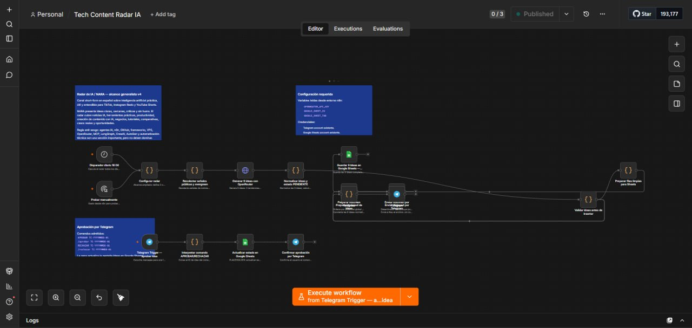

# Case Study: Daily Content Pipeline

> Public portfolio case study. All names, IDs, domains, tokens, chat identifiers, email addresses, workflow data, logs, and infrastructure details are anonymized or replaced with placeholders.

## Problem

Design an automation workflow that transforms raw ideas into structured content drafts without auto-publishing or exposing private brand data.

## Architecture

A scheduled trigger starts the workflow, loads a sanitized topic list, generates a structured draft through an API node, stores review metadata, and sends a notification for manual approval. Publishing remains a human-controlled step.

## Tools used

- n8n
- Schedule Trigger
- HTTP Request / AI provider placeholder
- Set / Code nodes
- Email or chat notification
- Manual approval checkpoint

## Difficulties encountered

- Preventing accidental auto-publication.
- Keeping credentials out of workflow exports.
- Designing workflow examples that are useful but not tied to private accounts.
- Separating generation from approval.

## Solution applied

Created an example workflow JSON with placeholder credentials and documented a review-first pipeline. The workflow demonstrates the logic while excluding real API keys, accounts, and production data.

## Lessons learned

- Automation should not remove human approval from brand-sensitive publishing.
- Public workflow exports must use placeholders.
- Good n8n documentation explains intent, node responsibilities, and failure modes.
