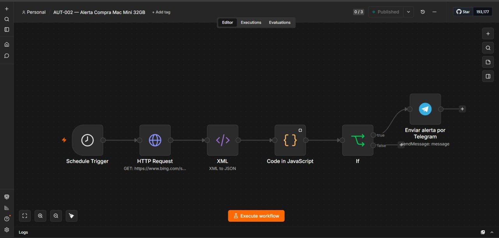

# Case Study: Gmail Alert System

> Public portfolio case study. All names, IDs, domains, tokens, chat identifiers, email addresses, workflow data, logs, and infrastructure details are anonymized or replaced with placeholders.

## Problem

Create a monitoring-style workflow that can send email alerts for important events without exposing real Gmail credentials, addresses, or message history.

## Architecture

A webhook or scheduled trigger receives a sanitized event. The workflow validates severity, formats a safe alert body, and sends it through a placeholder email node. Credentials are referenced by name only and are not included in the exported example.

## Tools used

- n8n
- Webhook or Schedule Trigger
- IF / Switch node
- Set node
- Email/Gmail node with placeholder credential
- Environment variables

## Difficulties encountered

- Gmail workflows often contain sensitive addresses and OAuth credentials.
- Alerts can accidentally include private payloads.
- Public examples must demonstrate the pattern without using real inboxes or recipients.

## Solution applied

Documented a sanitized alert pattern using fake recipients, generic event payloads, placeholder credential names, and a security checklist for redacting payloads before notifications.

## Lessons learned

- Email automation needs strict payload minimization.
- Credentials should live in n8n credential storage, not exported JSON.
- Alert workflows should be testable with fake events.
