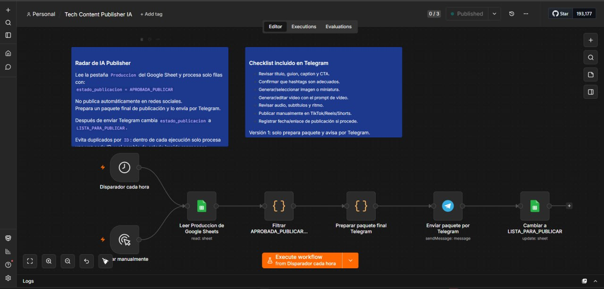

# Case Study: Workflow Design Decisions

> Public portfolio case study. All names, IDs, domains, tokens, chat identifiers, email addresses, workflow data, logs, and infrastructure details are anonymized or replaced with placeholders.

## Problem

Explain how n8n workflows were structured for maintainability, security, and portfolio readability instead of exporting private production workflows directly.

## Architecture

Workflows are organized by use case, each with a README, an example JSON export, environment placeholders, and security notes. Nodes are named descriptively and secrets are represented only by placeholder credential references.

## Tools used

- n8n
- JSON workflow exports
- Markdown documentation
- `.gitignore`
- `env.example`
- Manual review checklist

## Difficulties encountered

- n8n exports can include credential references and operational details.
- Large workflow exports are hard to understand without documentation.
- Portfolio projects need clarity over raw complexity.

## Solution applied

Created simplified, sanitized workflow examples with supporting documentation. Each workflow highlights trigger, processing, output, security assumptions, and extension ideas.

## Lessons learned

- A workflow repo should be self-explanatory.
- Sanitized examples are better for portfolio than raw exports.
- Security decisions should be documented next to the workflows, not hidden in memory.
