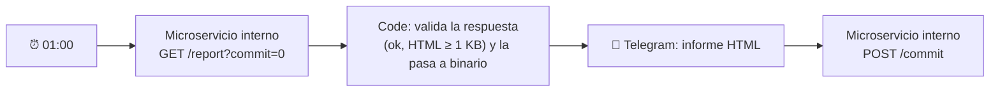
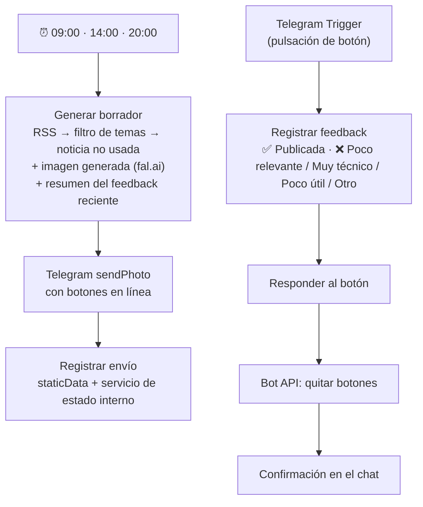

# Arquitectura de los workflows no publicados

Estos dos workflows existen en mi instancia de n8n, pero dependen de microservicios que corren en la red interna de mi servidor. Exportarlos obligaría a publicar direcciones, puertos y endpoints internos, así que aquí solo se describe su diseño.

## Radar diario de modelos de IA gratuitos por API

**Estado:** activo · cada día a la 01:00

Busca modelos de IA que se pueden usar por API con acceso gratuito, *free tier* o créditos de prueba. Consulta fuentes oficiales, compara con el informe anterior, lo traduce al español y envía un único documento HTML por Telegram.

**Decisión principal: confirmación en dos fases.** El servicio genera el informe sin guardar el estado (`commit=0`). Solo cuando Telegram acepta el documento, n8n llama a `/commit` para que el servicio marque esos modelos como ya notificados. Si el envío falla, el siguiente informe vuelve a incluirlos y no se pierde ninguna novedad.

n8n hace de orquestador (horario, validación, entrega y confirmación). La recogida y comparación de datos está en un servicio aparte que se puede probar por separado.

## @IAradar · borradores con feedback

**Estado:** en pausa (inactivo)

Genera borradores de publicación sobre noticias de IA para la cuenta de X [@IAradarES](https://x.com/IAradarES) y tiene en cuenta lo que publico y lo que descarto.

- **Humano en el bucle con botones:** cada borrador llega por Telegram con botones. Mi respuesta se guarda (hasta 200 registros) y el generador resume los últimos 40 (qué publiqué y por qué descarté el resto) antes de preparar el siguiente borrador.
- **Memoria en dos niveles:** `staticData` del workflow y un servicio de estado interno protegido con token *Bearer*.
- **Nada se publica solo:** el workflow nunca publica en X.

**Antes de reactivarlo:** tiene un webhook de prueba sin autenticación que hay que eliminar o proteger. Mientras el workflow esté inactivo, ese webhook no está expuesto.
