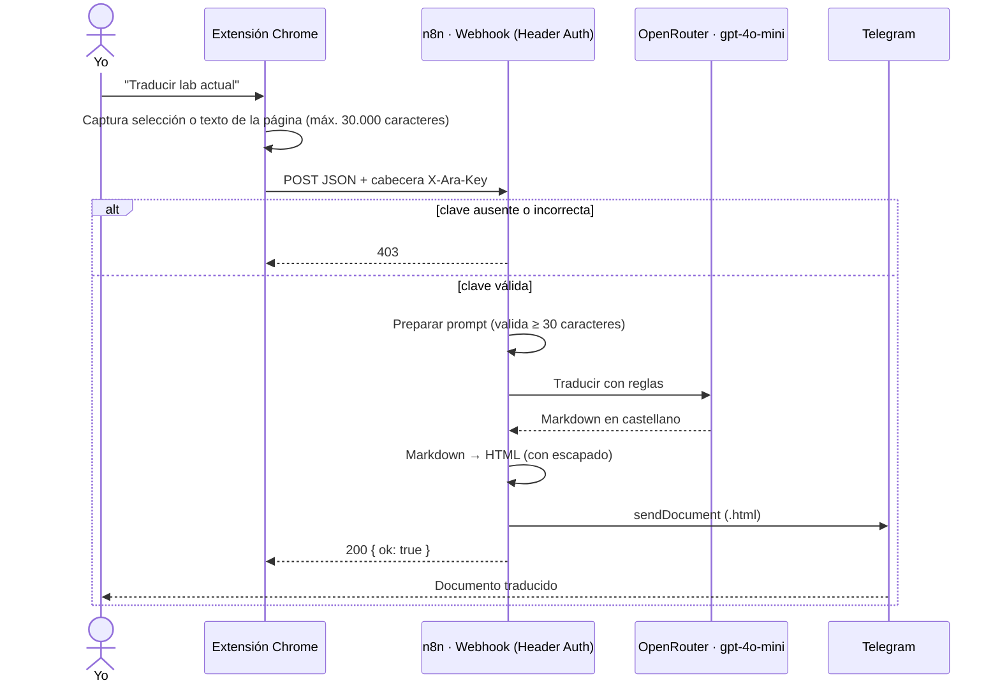

# Cyber Lab Translator · Español técnico

Extensión de Chrome + workflow de n8n que traduce salas de **TryHackMe** y retos de **pwn.college** al castellano. Mantiene en inglés los tecnicismos de ciberseguridad y el resultado llega como documento HTML por Telegram.

## Problema

Los labs de ciberseguridad están en inglés técnico. Un traductor genérico traduce también los términos que hay que conocer en inglés (*reverse shell*, *privilege escalation*, *payload*...) y a veces cambia comandos o rutas. Yo quería entender el enunciado sin perder el vocabulario del sector y sin que ninguna herramienta me diera la solución.

## Solución

- **Extensión (Manifest V3):** con un clic captura el texto de la sala (o solo la parte seleccionada) y lo envía al webhook con una cabecera de autenticación.
- **Workflow de 6 nodos:** valida el texto, construye un prompt con reglas estrictas, traduce con un LLM, genera un HTML con estilos propios y lo envía por Telegram.



## Características

- **Captura inteligente:** si hay texto seleccionado (≥ 20 caracteres) envía solo eso. Si no, busca el contenedor principal de la página (`main`, `article`, contenedores de tareas...). Por encima de 30.000 caracteres recorta y avisa.
- **Reglas del prompt:** traducir las explicaciones, mantener en inglés una lista de más de 50 tecnicismos y herramientas, no tocar comandos, rutas, IPs, puertos, hashes ni flags, **no resolver el lab ni responder preguntas** y no inventar pasos.
- **Salida HTML autocontenida** con un tema oscuro. El Markdown del LLM se convierte en el propio nodo, escapando `& < > " '` para que el contenido del lab no pueda inyectar HTML.
- **Errores legibles en la extensión:** 401/403 (clave rechazada), 404 (workflow inactivo), 500 (fallo interno) y texto insuficiente.
- **Temperatura 0.05:** prima la fidelidad sobre la creatividad.

## Stack

JavaScript (Chrome Extensions Manifest V3: `activeTab`, `scripting`, `storage`) · n8n (Webhook, Code, HTTP Request, Telegram, Respond to Webhook) · OpenRouter · Telegram Bot API

## Instalación

### 1. Workflow

1. Importa `workflow.json` en n8n.
2. Crea una credencial **Header Auth** con *Name* `X-Ara-Key` y un valor aleatorio largo. Por ejemplo, en PowerShell:
   ```powershell
   [Convert]::ToHexString([Security.Cryptography.RandomNumberGenerator]::GetBytes(32))
   ```
3. Asígnala en el nodo *Recibir room desde extensión*. En el nodo de Telegram asigna tu credencial **Telegram API**.
4. Define `OPENROUTER_API_KEY` y `TELEGRAM_CHAT_ID` (ver [`env.example`](../../env.example)) y activa el workflow.

### 2. Extensión

1. En `extension/popup.js` cambia `WEBHOOK_URL`, y en `extension/manifest.json` cambia `host_permissions`, por el dominio de tu n8n.
2. Abre `chrome://extensions`, activa el **Modo desarrollador** y pulsa **Cargar descomprimida** eligiendo la carpeta `extension/`.
3. Abre el popup, despliega **Clave del webhook**, pega el mismo valor que pusiste en la credencial y guárdalo.

## Uso

Abre una sala de TryHackMe o un reto de pwn.college y pulsa **Traducir lab actual**. Para traducir solo una tarea, selecciona su texto antes de pulsar.

## Estructura

```text
cyber-lab-translator/
├── workflow.json          Exportación anonimizada del workflow
└── extension/
    ├── manifest.json      MV3: permisos y dominios permitidos
    ├── popup.html         Interfaz: botón, estado y campo de clave
    ├── popup.js           Captura, envío autenticado y gestión de errores
    └── icons/
```

## Seguridad

- **Autenticación del webhook:** el nodo Webhook usa *Header Auth*. Una petición sin la cabecera `X-Ara-Key`, o con un valor incorrecto, se rechaza con **403** antes de ejecutar ningún nodo (comprobado con `curl`). Así nadie ajeno puede gastar créditos del LLM ni enviarme mensajes.
- **La clave no está en el código.** En n8n vive en una credencial cifrada. En el navegador vive en `chrome.storage.local` y solo se escribe desde el popup.
- **Permisos mínimos:** `activeTab` + `scripting` (solo se inyecta el script al pulsar el botón) y `host_permissions` limitados a TryHackMe, pwn.college y el dominio de n8n.
- **Contenido no confiable:** el texto del lab se trata como dato. Se escapa al generar el HTML y el prompt prohíbe expresamente resolver el lab o dar flags.

## Mejoras pendientes

- No hay límite de peticiones en el webhook. Con la autenticación el riesgo es bajo, pero un límite por minuto evitaría gastos accidentales.
- La clave de OpenRouter se inyecta desde `$env`. Sería mejor usar una credencial de n8n.
- La extensión no está publicada en la Chrome Web Store: se instala en modo desarrollador.

## Aprendizajes

- **Un webhook "secreto" no es un webhook seguro.** La primera versión no tenía autenticación y dependía de que nadie conociera la URL. Al añadir *Header Auth* hubo que coordinar dos piezas, la extensión que envía la clave y el servidor que la exige: si una cambia antes que la otra, el servicio se corta.
- Un prompt con **reglas negativas explícitas** ("no resuelvas", "no inventes") y una temperatura baja da traducciones fieles y útiles para estudiar.
- La conversión Markdown → HTML en el propio workflow evita dependencias, pero obliga a escapar con cuidado todo lo que viene del LLM.
