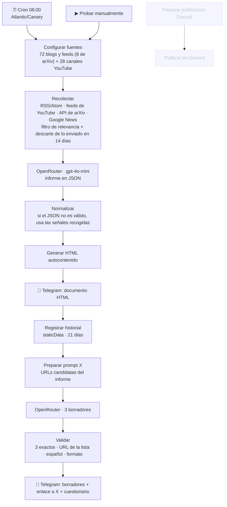

# Daily AI Briefing (AUT-003)

Informe diario de inteligencia artificial en español que llega a mi Telegram a las 08:00 como un documento HTML. Después del informe llegan 3 borradores para X que reviso y publico a mano.

## Problema

Seguir la actualidad de la IA en español implica revisar decenas de blogs, canales de YouTube y papers cada día. Quería un único resumen que filtrara lo relevante, no repitiera lo que ya había leído y me propusiera ideas de publicación sin publicar nada por su cuenta.

## Solución

Un workflow de 16 nodos (14 activos) que recoge señales de unas 100 fuentes, descarta lo ya enviado, pide a un LLM un informe estructurado en JSON, lo convierte en HTML y lo envía por Telegram. Con ese mismo informe genera 3 borradores para X, los valida y me los manda con un enlace para abrirlos en X.

## Flujo

La rama de Discord está **desactivada** y desconectada del flujo: sus webhooks se retiraron y el diccionario `WEBHOOKS` está vacío a propósito.

## Características

- **Fuentes variadas:** blogs de IA y ciberseguridad en español, medios tecnológicos, blogs de empresas, plataformas de formación gratuita, 28 canales de YouTube y 8 consultas a arXiv (LLM, agentes, multimodal, RL...).
- **Resolución de canales de YouTube sin API key:** busca el `channel_id` a partir del *handle* y lee el feed público `feeds/videos.xml`.
- **Filtrado en código:** expresiones regulares de temas incluidos y excluidos (sorteos, ofertas, móviles, fútbol...), descarte de noticias de años antiguos y deduplicación por URL canónica y por título normalizado.
- **Memoria entre ejecuciones:** `$getWorkflowStaticData('global')` guarda las claves de lo enviado (hasta 30 entradas, 21 días) y el recolector descarta lo que salió en los últimos 14 días.
- **Informe HTML** con estas secciones: resumen ejecutivo, creadores destacados, noticias, herramientas y modelos, papers, tendencias y fuentes revisadas.
- **Borradores para X controlados:** el validador exige exactamente 3 borradores y comprueba que cada URL esté en la lista de candidatas (así el LLM no puede inventar enlaces), que el texto esté en español y que cumpla un formato (3–5 líneas, máximo 2 hashtags y 2 emojis). Si algo falla, la ejecución se detiene con un error explícito.
- **Humano en el bucle:** cada borrador llega con un enlace `x.com/intent` para abrirlo en X y un cuestionario sobre qué publiqué y por qué descarté el resto.
- **Reintentos:** los nodos HTTP y Telegram reintentan 3 veces con 5 s de espera.

## Stack

n8n (Schedule, Manual Trigger, Code, HTTP Request, Telegram) · JavaScript · OpenRouter (`openai/gpt-4o-mini`) · RSS/Atom · API de arXiv · Telegram Bot API

## Configuración

| Qué | Dónde |
|---|---|
| `OPENROUTER_API_KEY` | Variable de entorno del servidor de n8n. La leen los dos nodos HTTP de OpenRouter |
| `TELEGRAM_CHAT_ID` | Variable de entorno. Chat al que llega todo |
| Credencial **Telegram API** | Asígnala en *Enviar documento blog por Telegram* y *Enviar 3 borradores X…* |
| Zona horaria | `Atlantic/Canary` en los ajustes del workflow |
| Fuentes | Array `sources` del nodo *Configurar fuentes* |

En los nodos Code, n8n debe permitir el acceso a `$env` (`N8N_BLOCK_ENV_ACCESS_IN_NODE=false`). Ver [`docs/setup.md`](../../docs/setup.md).

## Uso

1. Importa `workflow.json`, asigna la credencial de Telegram y define las variables.
2. Pulsa **Probar manualmente**. En unos minutos llegan el HTML y los borradores.
3. Activa el workflow para que se ejecute cada día a las 08:00.

> El historial (`staticData`) solo se guarda en ejecuciones de producción, no en las manuales. Así puedes probar sin que las noticias de prueba cuenten como ya enviadas.

## Seguridad

- La exportación no incluye credenciales, historial ni el ID real del chat (se cambió por `$env.TELEGRAM_CHAT_ID`).
- El LLM solo recibe titulares y resúmenes públicos. No recibe datos personales.
- No hay publicación automática en ninguna red social.

## Mejoras pendientes

- La clave de OpenRouter se lee de `$env` y se inyecta en una cabecera. Sería más limpio usar una credencial de n8n (Header Auth) para que no aparezca en la configuración del nodo.
- No hay un *Error Workflow*: si una ejecución falla, me entero solo porque no llega el informe.
- *Configurar fuentes* es un nodo Code de unos 17.000 caracteres. La lista de fuentes estaría mejor en una Data Table de n8n, editable sin tocar código.
- Si YouTube cambia el HTML de sus páginas, la resolución de `channel_id` puede dejar de funcionar sin avisar. Solo aparece como estado en `collectionStatus`.

## Aprendizajes

- Pedir **JSON** al LLM y validarlo en código es mucho más robusto que interpretar texto libre. Aun así hace falta un plan B para cuando el JSON llega roto.
- La **lista blanca de URLs** es una forma barata y eficaz de evitar que el modelo invente enlaces.
- El historial se registra **después** de que Telegram acepte el documento. Si el envío falla, nada se marca como enviado y la noticia puede salir al día siguiente.
